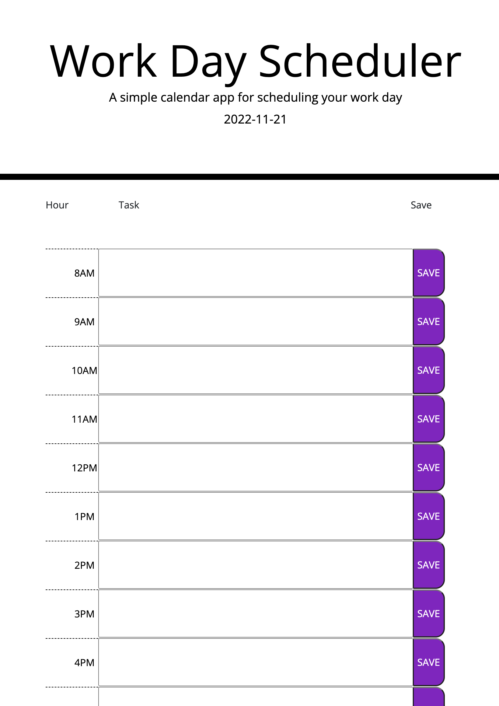

# Work Day Scheduler

  
  
       
  ## Description
  Create a simple calendar application that allows a user to save events for each hour of the day. This app will run in the browser and feature dynamically updated HTML and CSS powered by jQuery.
  
  ## Table of Contents

  *[Installation](#installation)

  *[Usage](#usage)

  *[License](#license)

  *[Contributing](#contributing)

  *[Test](#test)

  *[Questions](#questions)
  
  
  ## Installation

  npm install
  
  ## Usage

  type out your schedule and itll record it
  
  ## License
  
  This project is licensed under 

  ## Contributing

  myself and tutors 
  
  ## Test

  type out your schedule and save 
  
  ## Questions

To see more of my projects, go to [darbybiddy](https://github.com/darbybiddy)
If you have any questions, you can contact me at [darbybiddy3@gmail.com](mailto:darbybiddy3@gmail.com)

